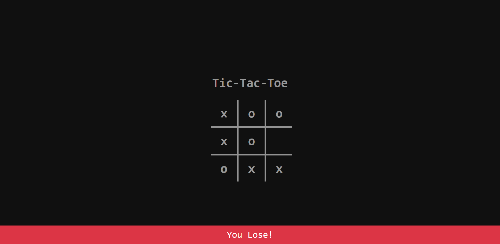

# Tic-Tac-Toe AI

A Tic-Tac-Toe solver that uses the minimax algorithm and alpha-beta pruning to make it unbeatable

## How it Works

Tic-Tac-Toe is what is known in game theory as a [zero-sum game](https://en.wikipedia.org/wiki/Zero-sum_game), meaning that an advantage to one side is a disadvantage in equal magnitude to the opponent. As such, minimizing the maximum potential loss is equivalent to maximizing the minimum potential gain, making a "minimax" algorithm the optimal strategy.

### Minimax Algorithm

We let the maximizing player be the AI, and the minimizing player be the human. This means that the AI's optimal strategy is to maximize the game score, while the human's optimal strategy is to minimize the game score.

The minimax algorithm for Tic-Tac-Toe works by considering every possible node in the game tree (i.e. all legal moves), and evaluating each move with a score.

The algorithm recurses through the game tree until it hits one of three base cases:

1. AI win
2. Human win
3. Draw

It then assigns a base score of 10, -10, or 0, respectively.

We also must consider the fact that the algorithm should favour moves which provide quicker wins. Thus, we also increment a depth variable at each move, and either subtract (if the player is maximizing) or add (if the player is minimizing) to the base score, making a higher depth less favourable.

### Alpha-Beta Pruning

In order to optimize the computational time of the algorithm, alpha-beta (α/β) pruning is used.

Let α be the best score that the maximizing player can currently guarantee, and β be the best score that the minimizing player can currently guarantee. α is initialized to -Infinity, and β is initialized to Infinity (i.e. the worst possible cases).

At every move, we set α = max(α, score) if the player is maximizing, and β = min(β, score) if the player is minimizing. If at any point β ≤ α, we "prune" the node, as it is no longer favourable to recurse through its subtrees (i.e. a better move already exists, so there is no point in continuing).

With the help of Alpha-Beta pruning, we are able to search through the game tree at a considerably faster rate.

## Credits

Tic-Tac-Toe favicon created by [Freepik - Flaticon](https://www.flaticon.com/free-icons/tic-tac-toe)
